# Quantum Orbital 3D Visualizer

<div align="center">

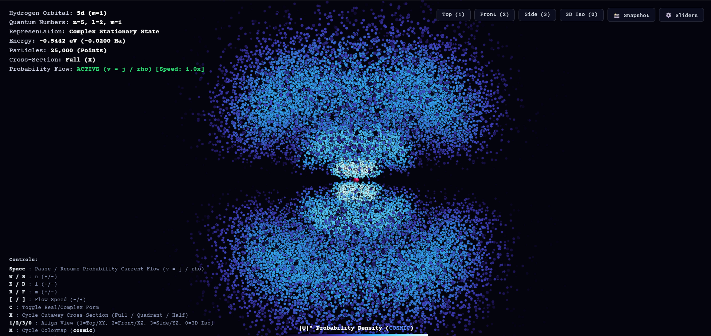

[](https://www.python.org/)
[](https://fastapi.tiangolo.com/)
[](https://threejs.org/)
[](https://vercel.com)
[](https://render.com)
[](tests/)

*An interactive, high-performance 3D visualizer for hydrogen atomic orbitals, exact wavefunctions, and physical quantum probability current streamlines.*

[**Live Web App**](#web-application-threejs--fastapi) • [**Visual Gallery**](#gallery-of-quantum-orbitals) • [**Video Demo**](#video-walkthrough) • [**Physics & Math**](#physics--mathematical-formulation) • [**Desktop App**](#desktop-python-viewer-pyvista)

</div>

---

## Overview

This project is a modern Python + WebGL recreation and enhancement of the C++ / OpenGL [Atoms](https://github.com/kavan010/Atoms) visualizer by Kavan Patel. It computes the **exact non-relativistic Schrödinger wavefunctions** for atomic hydrogen in 3D and renders them through:

1. **Interactive WebGL Web App (Three.js + FastAPI)**: Zero-install browser experience with real-time probability current flow ($\vec{v} = \mathbf{j}/\rho$), 11 scientific color palettes, stationary cross-section cutaways, view alignment presets, and up to **$10\times$ speed control**.
2. **Desktop 3D Point-Cloud Visualizer (PyVista)**: Hardware-accelerated desktop viewer with live HUD telemetry, spatial cutaways, and interactive quantum number navigation.
3. **Vectorized Inverse-CDF Sampling**: Rapid, continuous inverse-CDF random sampling of electron coordinates from radial $r^2 |R_{nl}|^2$ and angular $\sin\theta |Y_{lm}|^2$ densities.
4. **GPU Volume Raymarcher (ModernGL / GLSL)**: Continuous 3D volumetric raymarching through orbital electron density fields.

---

## Video Walkthrough

Watch the real-time probability current flow and interactive camera controls in action:

<div align="center">

https://github.com/user-attachments/assets/orbital-demo

*(Click below to view the full recorded demo in HD)*

[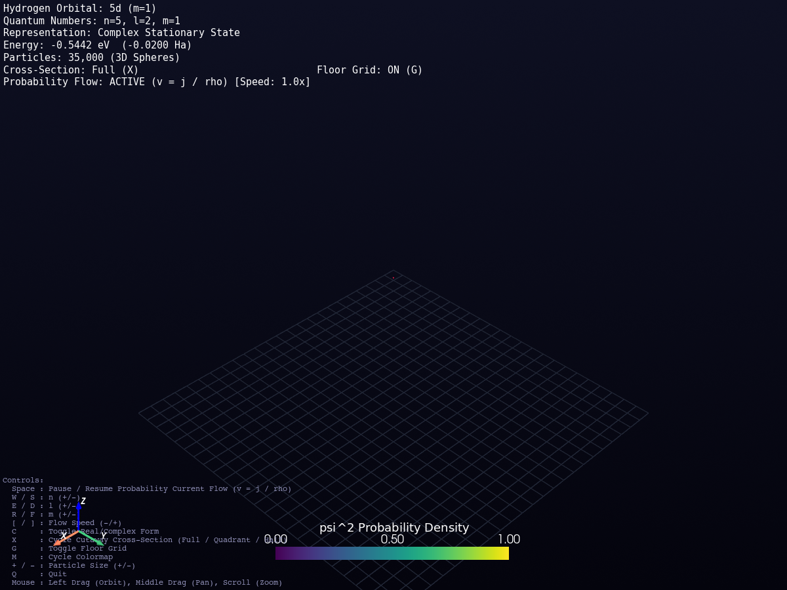](renders/demo.mp4)

<sub>*Direct video file available at [`renders/demo.mp4`](renders/demo.mp4)*</sub>

</div>

---

## Gallery of Quantum Orbitals

All images below are generated directly from our exact analytical simulation engine:

### 1. Fundamental S, P, D, and F Atomic States

| $1s$ Ground State ($n=1, l=0, m=0$) | $2s$ Excited State ($n=2, l=0, m=0$) |
|:---:|:---:|
| 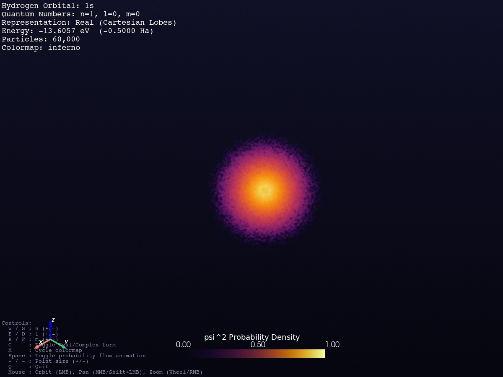 | 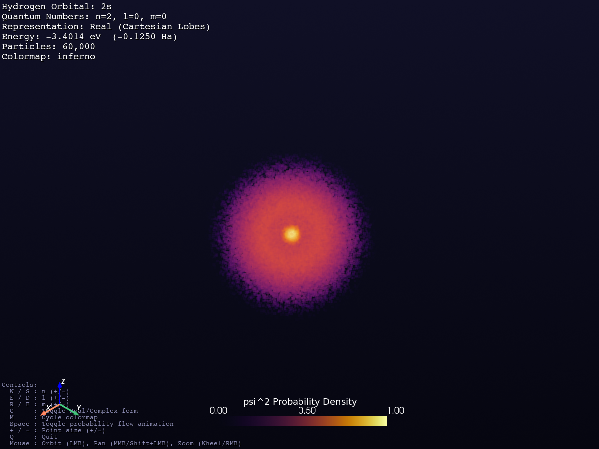 |
| *Spherical ground state ($E_1 = -13.60\,\text{eV}$)* | *Radial node at $r = 2a_0$ ($E_2 = -3.40\,\text{eV}$)* |

| $2p_z$ Orbital ($n=2, l=1, m=0$) | $2p_x$ Orbital ($n=2, l=1, m=\pm 1$) |
|:---:|:---:|
| 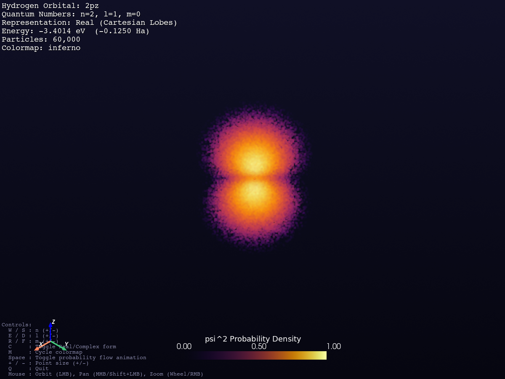 | 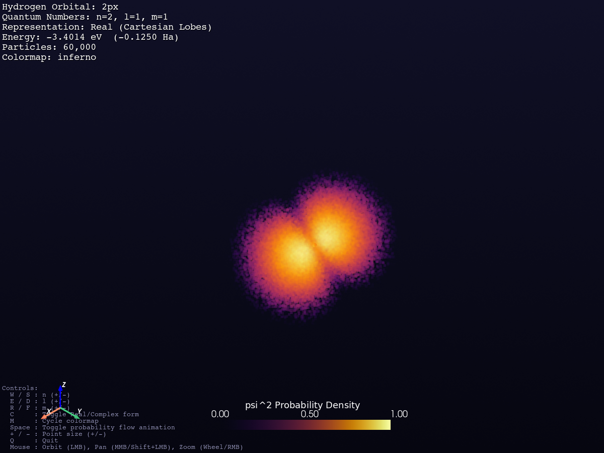 |
| *Axial dipole lobes with equatorial nodal plane* | *Real Cartesian linear combination $\frac{1}{\sqrt{2}}(Y_1^1 + Y_1^{-1})$* |

| $3d_{z^2}$ Orbital ($n=3, l=2, m=0$) | $3d_{x^2-y^2}$ Orbital ($n=3, l=2, m=\pm 2$) |
|:---:|:---:|
| 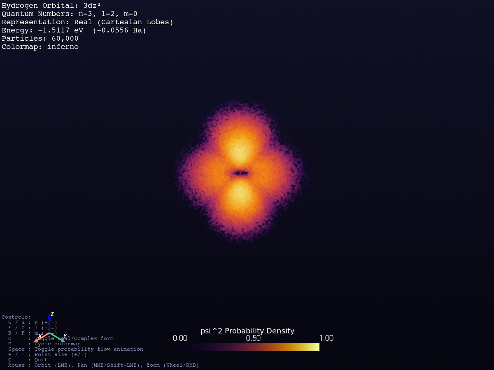 | 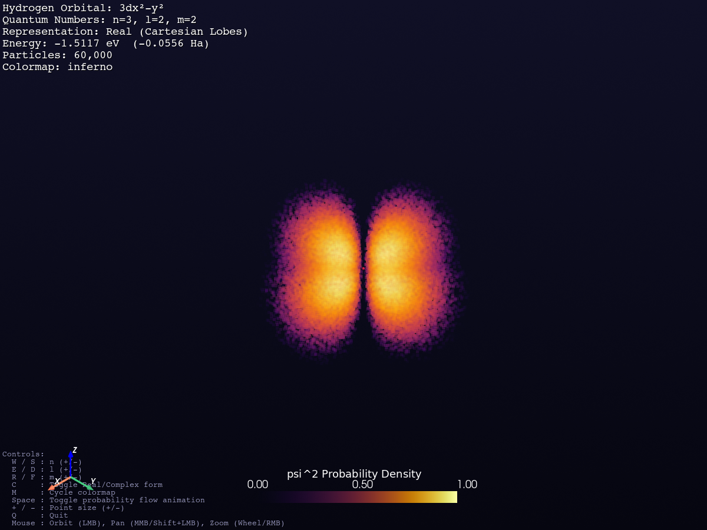 |
| *Toroidal doughnut ring & vertical polar lobes* | *Quadrupole lobes aligned with X and Y axes* |

| $3d_{xz}$ Orbital ($n=3, l=2, m=\pm 1$) | $4f_{z^3}$ Orbital ($n=4, l=3, m=0$) |
|:---:|:---:|
| 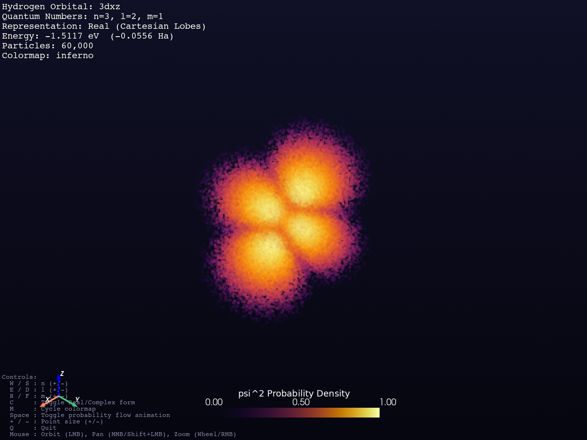 | 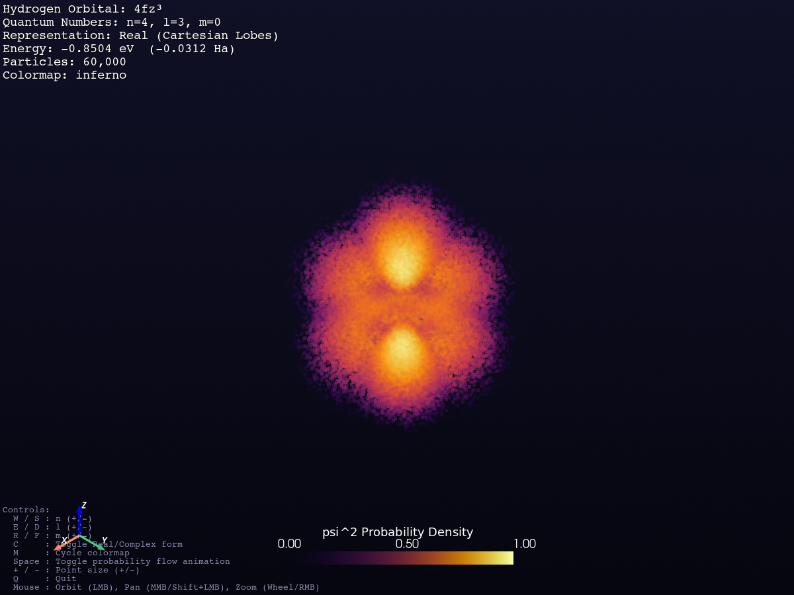 |
| *Diagonal planar lobes in XZ plane* | *Octupolar multi-lobed fundamental $F$ state* |

---

### 2. High-$n$ Rydberg State & Cutaway Cross-Sections

| MinutePhysics High-$n$ State ($n=5, l=2, m=1$) | Radial Nodal Cutaway ($3s$ Core Shells) |
|:---:|:---:|
|  | 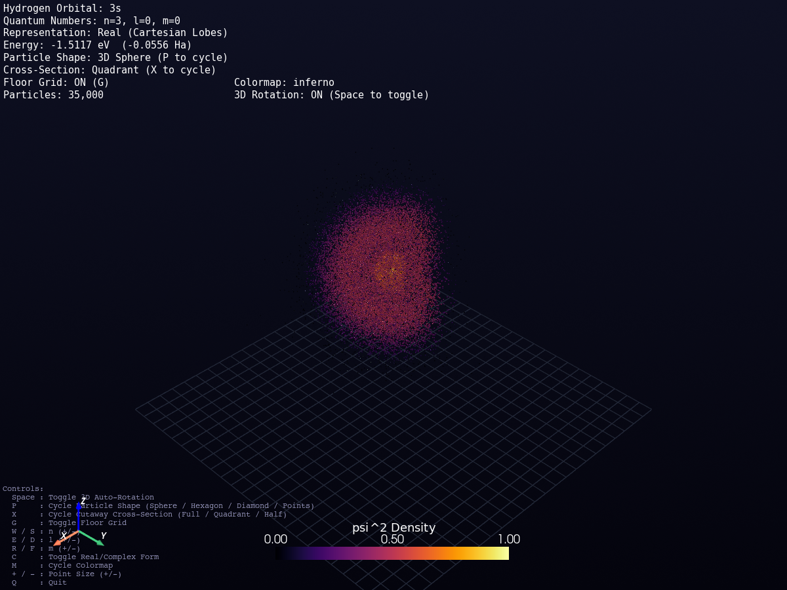 |
| *Complex probability flow with active circulation* | *Stationary quadrant cut revealing concentric internal shells* |

| 3D Hexagonal Point Cloud ($3d_{x^2-y^2}$) | 3D True Sphere Glyphs ($2p_z$) |
|:---:|:---:|
| 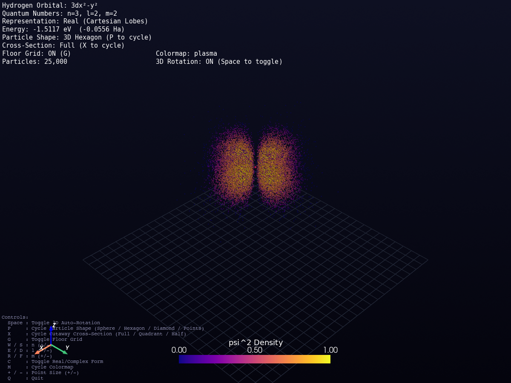 | 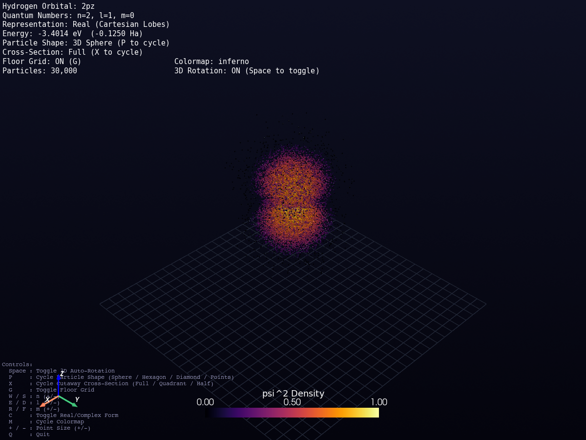 |
| *Point-cloud density rendering* | *Ray-traced spherical glyph visualization* |

---

## Web Application (Three.js + FastAPI)

The web visualizer runs completely in the browser via WebGL and can be hosted locally or deployed to the cloud for free.

### Run Locally
```bash
python run_web.py
```
This boots the local FastAPI server and opens `http://localhost:8000` automatically in your default browser.

### Key Web Features
- **Physical Probability Current**: Particles circulate with exact quantum drift velocity $\mathbf{v} = \frac{\hbar m}{m_e r \sin\theta}\hat{\boldsymbol{\phi}}$ (scalable up to **10× speed**).
- **11 Scientific Colormaps**: `Inferno`, `Viridis`, `Plasma`, `Magma`, `Cyberpunk`, `Emerald`, `Cosmic`, `Solar`, `Turbo`, `CoolWarm`, `Hot`.
- **View Alignment Toolbar**: Quick 1-click alignments for `Top (1)`, `Front (2)`, `Side (3)`, and `3D Iso (0)`.
- **Stationary Cutaway Cross-Sections**: Press <kbd>X</kbd> to toggle Full, Quadrant, or Half spatial cuts to inspect interior nodal spheres.
- **Snapshot Generator**: Instant 1-click PNG export with transparency and HUD overlay.

---

## 1-Click Cloud Deployment

### Deploy to Vercel (Hobby Free Tier)
1. Push this repository to your GitHub account.
2. Visit [vercel.com](https://vercel.com) and click **"Add New Project"**.
3. Select this repository and click **Deploy**.
4. Vercel automatically detects [`vercel.json`](vercel.json), serving the static Three.js frontend via Edge CDN while executing the FastAPI quantum sampling backend in Python Serverless Functions.

### Deploy to Render
1. Create a **New Web Service** connected to your GitHub repository in [render.com](https://render.com).
2. Set Build Command: `pip install -r requirements.txt`
3. Set Start Command: `uvicorn api.index:app --host 0.0.0.0 --port $PORT`

---

## Desktop Python Viewer (PyVista)

Launch the interactive 3D desktop point-cloud visualizer:

```bash
# Launch interactive 2pz orbital (default)
python -m atoms_py.app

# Launch 3dx2-y2 orbital with 80,000 particles and Plasma colormap
python -m atoms_py.app -n 3 -l 2 -m 2 --colormap plasma -N 80000

# Launch complex 3d state (m = 1) with active probability current flow
python -m atoms_py.app -n 3 -l 2 -m 1 --complex-form
```

### Desktop Keyboard Controls
| Key | Action |
|:---:|---|
| <kbd>W</kbd> / <kbd>S</kbd> | Increase / Decrease principal quantum number $n$ ($1 \le n \le 7$) |
| <kbd>E</kbd> / <kbd>D</kbd> | Increase / Decrease azimuthal quantum number $l$ ($0 \le l < n$) |
| <kbd>R</kbd> / <kbd>F</kbd> | Increase / Decrease magnetic quantum number $m$ ($-l \le m \le l$) |
| <kbd>C</kbd> | Toggle Real (Cartesian) vs. Complex (Stationary) representation |
| <kbd>X</kbd> | Cycle Cutaway Cross-Section (Full / Quadrant / Half) |
| <kbd>[</kbd> / <kbd>]</kbd> | Decrease / Increase Flow Speed ($0.1\times$ to $10.0\times$) |
| <kbd>M</kbd> | Cycle Colormaps (`inferno`, `plasma`, `magma`, `turbo`, `viridis`, etc.) |
| <kbd>Space</kbd> | Pause / Resume probability current circulation |
| <kbd>+</kbd> / <kbd>-</kbd> | Increase / Decrease particle render size |
| **Mouse Left** | Orbit camera ($Z$-up orientation) |
| **Mouse Right / Shift+Left** | Pan camera |
| **Mouse Scroll** | Zoom in / out |

---

## Physics & Mathematical Formulation

### 1. Schrödinger Wavefunction in Atomic Units ($a_0 = 1$)
$$\psi_{nlm}(r, \theta, \phi) = R_{nl}(r) Y_l^m(\theta, \phi)$$

### 2. Radial Wavefunction $R_{nl}(r)$
$$R_{nl}(r) = \sqrt{\left(\frac{2}{n a_0}\right)^3 \frac{(n-l-1)!}{2n (n+l)!}} e^{-\rho/2} \rho^l L_{n-l-1}^{2l+1}(\rho), \quad \rho = \frac{2r}{n a_0}$$

Where $L_{n-l-1}^{2l+1}(\rho)$ are the Associated Laguerre Polynomials.

### 3. Radial Probability Density & Bohr Peaks
$$P(r) = r^2 |R_{nl}(r)|^2 \implies r_{\text{peak}} = n^2 a_0 \quad (\text{for circular states } l = n - 1)$$
- $1s \implies r_{\text{peak}} = 1 a_0$
- $2p \implies r_{\text{peak}} = 4 a_0$
- $3d \implies r_{\text{peak}} = 9 a_0$
- $4f \implies r_{\text{peak}} = 16 a_0$

### 4. Physical Quantum Probability Current Flow
The probability current density $\mathbf{j}$ for a stationary state $\psi_{nlm}$ with azimuthal phase $e^{i m \phi}$ is:
$$\mathbf{j} = \frac{\hbar}{m_e} \operatorname{Im}(\psi^* \nabla \psi) = \frac{\hbar m}{m_e r \sin\theta} |\psi|^2 \hat{\boldsymbol{\phi}}$$

The corresponding particle drift velocity field is:
$$\mathbf{v} = \frac{\mathbf{j}}{\rho} = \frac{\hbar m}{m_e r \sin\theta} \hat{\boldsymbol{\phi}} \implies \omega = \frac{d\phi}{dt} = \frac{m}{r^2 \sin^2 \theta}$$

- For $m=0$ (or Real Cartesian orbitals): $\mathbf{v} = 0 \implies$ stationary cloud.
- For $m \ne 0$: particles swirl azimuthally about the $Z$-axis, faster near the core and equator.

---

## Testing & Physical Validation

Run the 44-test verification suite with `pytest`:

```bash
pytest -v
```

All 44 tests validate:
- Analytical wavefunction normalization ($\int |\psi|^2 dV = 1.0$).
- Peak radial positions matching Bohr theory ($r_{\text{peak}} = n^2 a_0$).
- Spherical harmonic orthogonality and nodal count ($n - l - 1$ radial nodes, $l$ angular nodes).
- Inverse-CDF sampling correlation ($r > 0.99$).
- Probability current drift velocity calculations.

---

## Project Structure

```
orbital/
├── app.png                  # Main visualizer banner screenshot
├── run_web.py               # 1-click local web launcher
├── vercel.json              # Vercel serverless deployment config
├── render.yaml              # Render web service config
├── requirements.txt         # Core dependencies
├── api/
│   └── index.py             # FastAPI backend (serverless API endpoint)
├── public/
│   ├── index.html           # Web application layout & clean HUD
│   ├── style.css            # Dark scientific HUD styling
│   └── app.js               # Three.js 3D WebGL engine & particle dynamics
├── atoms_py/
│   ├── wavefunction.py      # Exact R_nl, Y_lm, energy, quantum numbers
│   ├── sampling.py          # Vectorized inverse-CDF Monte Carlo sampler
│   ├── render_points.py     # PyVista 3D desktop viewer
│   ├── raymarch.py          # ModernGL & GLSL GPU volume raymarcher
│   ├── app.py               # CLI entry point for desktop viewer
│   └── tests/
│       ├── test_wavefunction.py
│       └── test_sampling.py
└── renders/                 # High-resolution simulation renders & demo video
    ├── demo.mp4
    ├── orbital_1s.png
    ├── orbital_2s.png
    ├── orbital_2pz.png
    ├── orbital_3dz2.png
    ├── orbital_3dx2y2.png
    └── minutephysics_n5_l2_m1.png
```

---

## Credits & References

- **Original C++ / OpenGL Implementation**: Kavan Patel ([kavan010/Atoms](https://github.com/kavan010/Atoms)).
- **MinutePhysics Reference**: *"What Does An Atom Really Look Like?"* (Concept of probability current circulation in complex quantum states).
- **Python & WebGL Engine**: Developed with NumPy, SciPy, FastAPI, Three.js, and PyVista.

---

<div align="center">
<b>Hydrogen Quantum Orbital Visualizer</b> • Exact Analytical Wavefunctions in 3D
</div>
